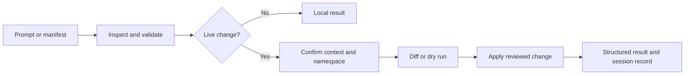

import { Aside, Badge, Card, CardGrid, TabItem, Tabs } from '@astrojs/starlight/components';
import LinkCard from '@f5-sales-demo/docs-theme/components/LinkCard.astro';

<Badge text="Open source" variant="success" /> <Badge text="Terminal first" variant="tip" /> <Badge text="F5 XC workflows" variant="note" />

xcsh brings an interactive coding agent, deterministic resource commands, persistent sessions, and an extension platform into one shell. It is derived from the open-source pi project and specializes in F5 Distributed Cloud workflows while remaining useful for general engineering work.

<Aside type="note" title="Independent project">
  xcsh is an independent open-source project. It is not an F5 product and is not distributed or supported as F5 software.
</Aside>

## Start with your platform

<Tabs syncKey="home-install">
  <TabItem label="macOS">

```sh
brew install f5-sales-demo/tap/xcsh
xcsh --version
```

  </TabItem>
  <TabItem label="Ubuntu or Debian">

Use the [signed apt repository](./getting-started/installation/#ubuntu-or-debian) for managed updates on AMD64 or ARM64.

  </TabItem>
  <TabItem label="Other platforms">

Use the verified installer, npm/Bun package, standalone release binary, or GHCR container described in [Installation](./getting-started/installation/).

  </TabItem>
</Tabs>

## One shell, several ways to work

<CardGrid>
  <Card title="Agentic terminal" icon="terminal">Plan, edit, run commands, inspect images, search, and coordinate specialized agents in a persistent session.</Card>
  <Card title="F5 XC manifests" icon="document">Validate offline, review a live diff, then create, apply, update, export, or delete with explicit context and namespace.</Card>
  <Card title="Interfaces everywhere" icon="puzzle">Use the terminal, VS Code, Chrome, Excel, Word, PowerPoint, headless protocols, or containers.</Card>
  <Card title="Composable automation" icon="seti:json">Extend xcsh with skills, plugins, MCP servers, tools, hooks, rules, the SDK, and worker processes.</Card>
</CardGrid>

## From intent to verified change



## Choose a task

<CardGrid>
  <LinkCard icon="lucide:rocket" title="Get started" href="./getting-started/" />
  <LinkCard icon="lucide:cloud" title="Manage F5 XC" href="./f5-distributed-cloud/" />
  <LinkCard icon="lucide:bot" title="Use the agentic shell" href="./agentic-shell/" />
  <LinkCard icon="lucide:blocks" title="Extend and automate" href="./extend-automate/" />
  <LinkCard icon="lucide:shield-check" title="Configure securely" href="./configure-secure/" />
  <LinkCard icon="lucide:book-open" title="Troubleshoot and reference" href="./troubleshooting-reference/" />
</CardGrid>

## Supported interfaces

Terminal CLI · interactive TUI · VS Code · Chrome · Microsoft Excel, Word, and PowerPoint · JSON/RPC/ACP · containers
