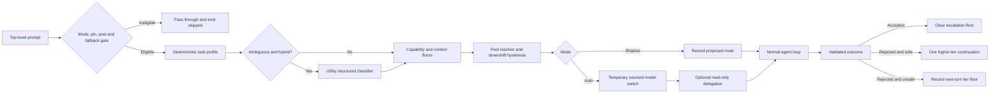

# Provider-Agnostic Dynamic Model Routing for xcsh

## 1. Summary and decisions

Implement a routing coordinator at the AgentSession boundary. It will profile each top-level task, select an appropriate model tier, account for context capacity, optionally dispatch bounded read-only subagents, and escalate only from validated evidence.

The router will complement—not replace—existing model roles, retry fallbacks, context promotion, compaction, and task execution.

Key decisions:

- Routing applies to any provider with an explicit tier-pool definition.
- Ship reviewed presets; never infer tiers from arbitrary model names.
- Initial presets:
    - OpenAI: Luna → utility, Terra → balanced, Sol → frontier.
    - Anthropic: Haiku → utility, Sonnet → balanced, Opus → frontier.
    - LiteLLM: separate OpenAI and Anthropic pools under the same litellm provider.

- Direct OpenAI and Anthropic use the same router through provider-specific pools.
- Untiered providers and models outside a pool pass through unchanged.
- Routing is family-sticky by default. Cross-family/provider routing requires an explicitly declared mixed pool or the existing retry fallback mechanism.
- Default mode is off; rollout proceeds through explicit shadow, then opt-in auto.
- A manual model selection is a hard pin until `/route auto`.
- Upgrades occur immediately; downshifts require two consecutive lower-tier profiles.
- The router chooses once before a tool loop and remains fixed during it. Existing retry fallback and context-overflow promotion remain emergency exceptions.
- Autonomous delegation is limited to read-only work, at most three subtasks, with no recursive autonomous delegation.
- No separate routing dollar budget. Existing concurrency, recursion, authentication, safety, and approval controls remain authoritative.

## 2. Architecture and public interfaces

### Capability and configuration model

Add a routing settings group:

```yaml
routing:
  mode: off                 # off | shadow | auto
  profiler: hybrid          # rules | hybrid
  familyPolicy: sticky      # sticky | configured-mixed
  delegation: read-only     # off | read-only
  delegationMaxTasks: 3
  downshiftAfterTurns: 2
  tierEffort:
    utility: low
    balanced: medium
    frontier: high
  pools: {}                 # Overrides or additional explicit pools
  disabledPresets: []
```

Each pool contains ordered, fully qualified model selectors for utility, balanced, and frontier. Selectors must be unique within a pool. Non-mixed pools must use one provider; mixed pools must explicitly opt in.

Built-in pools:

- `openai/gpt-5.6`: direct OpenAI models (e.g. `gpt-4o-mini` for utility, `gpt-4o` for balanced, `o3-mini`/`gpt-4.5-preview` for frontier).
- `anthropic/claude`: direct Anthropic models (e.g. `claude-3-5-haiku-latest` for utility, `claude-3-5-sonnet-latest` for balanced, `claude-3-opus-latest` for frontier).
- `litellm/openai`: internal LiteLLM Luna, Terra, and Sol (`gpt-5.6-luna`, `gpt-5.6-terra`, `gpt-5.6-sol`).
- `litellm/anthropic`: internal LiteLLM Haiku, Sonnet, and Opus.

At implementation start, pin the exact Anthropic and LiteLLM IDs from authenticated model inventories and official documentation. Missing models degrade the pool; a pool with fewer than two available tiers is ineligible and passes through.

Configuration precedence:

1. Explicit user pool override.
2. Reviewed built-in preset.
3. No pool and no name inference.

Candidate selection intersects the pool with authenticated, enabled, runtime-discovered, and `--models`-scoped models.

### Core types

Introduce public routing types:

```typescript
type RoutingTier = "utility" | "balanced" | "frontier";
type RoutingMode = "off" | "shadow" | "auto";
type RoutingDecisionSource = "rules" | "classifier" | "hybrid";

interface TaskProfile {
  complexityScore: number;
  desiredTier: RoutingTier;
  confidence: number;
  reasons: RoutingReasonCode[];
  requiredCapabilities: {
    vision: boolean;
    tools: boolean;
    minimumContextTokens: number;
  };
  delegation?: ReadOnlyDelegationPlan;
}

interface RoutingDecision {
  epochId: string;
  mode: RoutingMode;
  poolId?: string;
  anchorModel: string;
  desiredTier?: RoutingTier;
  effectiveTier?: RoutingTier;
  selectedModel?: string;
  source?: RoutingDecisionSource;
  applied: boolean;
  reasons: RoutingReasonCode[];
}

interface RoutingOutcome {
  epochId: string;
  status: "accepted" | "rejected";
  evidence: RoutingOutcomeEvidence[];
  safeToContinue?: boolean;
}
```

Extend `AgentSession` with:

- `getRoutingStatus()`
- `setRoutingMode(mode)`
- `clearRoutingPin()`
- `recordRoutingOutcome(outcome)`
- model-switch source metadata distinguishing manual, routing, retry fallback, and context promotion.

Expose session events:

- `routing_decision`
- `routing_applied`
- `routing_delegated`
- `routing_escalated`
- `routing_skipped`

Events include provider, pool, tier, model, sanitized reason codes, context estimate, decision duration, classifier usage, and token usage. They must never contain prompt text, credentials, headers, or tool output.

Persist mode overrides, pins, active pool, tier, downshift streak, and escalation floor as non-context session custom entries. On session resume, reset, or branch switching, downshift streak counters and escalation floors are contextually re-evaluated against the active turn branch history rather than relying on flat global custom entries.

### Profiling and resolution

Deterministic profiling starts at score 30:

- +25: prior validated rejection.
- +20: architecture, migration, security analysis, or explicit deep-review intent.
- +15: mutation spanning multiple targets/repositories or at least three independent deliverables.
- +10: image/special capability requirement.
- +10: context usage at least 60%; +20 at least 80%.
- +10: material ambiguity or missing acceptance conditions.
- -20: exact, single-step read, extraction, classification, summarization, or mechanical operation involving at most one target.

Clamp to 0–100:

- 0–30: utility
- 31–69: balanced
- 70–100: frontier

Hard capability, context, safety, and validated-outcome floors cannot be lowered by the classifier.

In hybrid mode, an ambiguous balanced profile invokes a one-shot structured classifier through the utility model in the active pool. It receives the bounded current request and structured metadata—not the conversation transcript—and has no tools. Confidence below 0.75, timeout, malformed output, or unavailable utility tier resolves to balanced.

Context resolution uses the existing context estimator and compaction reserve. A candidate is eligible only when:

`estimated input + max(existing reserveTokens, 15% of candidate context) < candidate contextWindow`

The resolver searches the desired tier, then higher tiers. It never selects a lower tier than the required quality/capability floor.

### Runtime flow



The coordinator runs after retry-fallback restoration but before API-key validation and compaction. It skips while an existing retry fallback remains active.

A rejected, trusted outcome may cause at most one post-loop escalation continuation. It switches one tier upward, continues from the existing transcript and tool results, and does not replay the prompt or completed actions. Unsafe continuations only set a floor for the next turn. Free-form model self-assessment cannot trigger escalation.

Autonomous delegation requires at least two independent read-only information targets. The classifier may return two or three schema-validated subtasks. Delegates:

- Use only read, grep, find, ls, lsp, and approved read-only search tools.
- Receive a minimal task/context pack.
- Use utility by default and balanced only when their own profile requires it.
- Cannot spawn children.
- Run through existing task concurrency and cancellation controls.
- Return results as attributed context for the parent.
- Never run in shadow mode.

Commands:

- `/route status`: display effective mode, eligibility, pool, pin, active tier/model, downshift streak, and last decision.
- `/route off`: stop future routing and retain the current model.
- `/route shadow`: calculate and report decisions without switching or delegating.
- `/route auto`: clear the manual model pin and route within the pool containing the current model.

## 3. Acceptance matrix and rollout

Required behavior:

- LiteLLM can independently route its OpenAI and Anthropic families without crossing them.
- Direct OpenAI and Anthropic use the same generic coordinator and pool contract.
- An untiered provider, unknown model, unavailable pool, or single-tier pool never changes models.
- Off and shadow modes never change the active model or launch delegates.
- Manual model selection remains fixed until `/route auto`.
- Context and capability requirements can raise but never lower the selected tier.
- A downshift requires two consecutive qualifying turns.
- Auxiliary classification is skipped for deterministic profiles.
- Router-controlled model choice remains fixed through the normal tool loop.
- Retry fallback and context promotion retain their existing behavior.
- Autonomous delegates are read-only, bounded, non-recursive, cancellable, and accounted for.
- Escalation requires trusted validation evidence and never blindly replays a turn.
- Session resume reproduces the prior routing state without adding routing metadata to model context.
- All route decisions are observable without leaking prompt or credential data.
