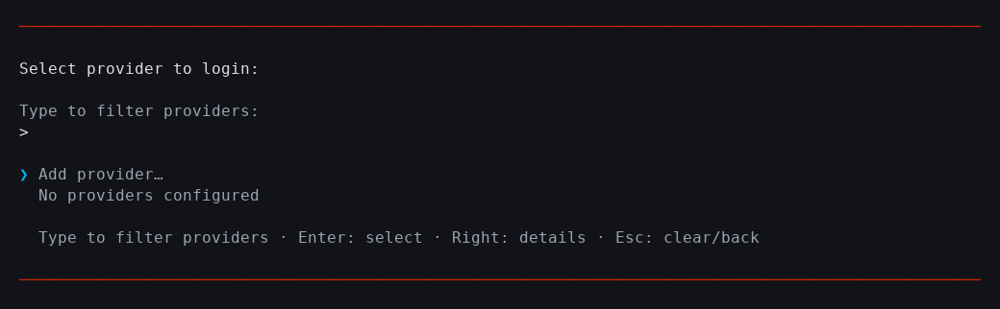
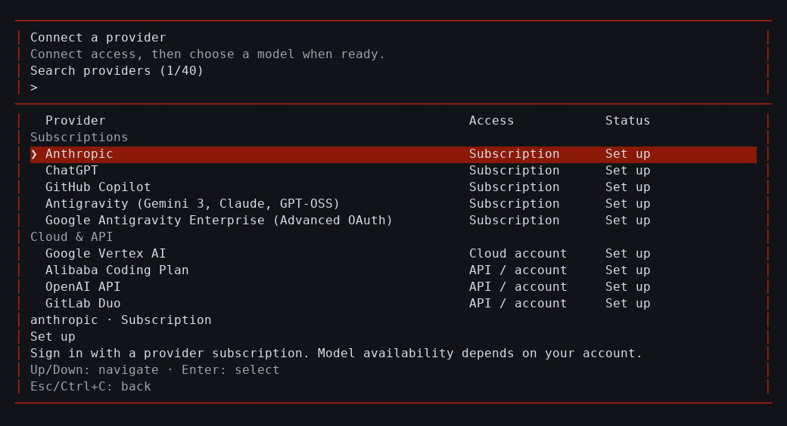
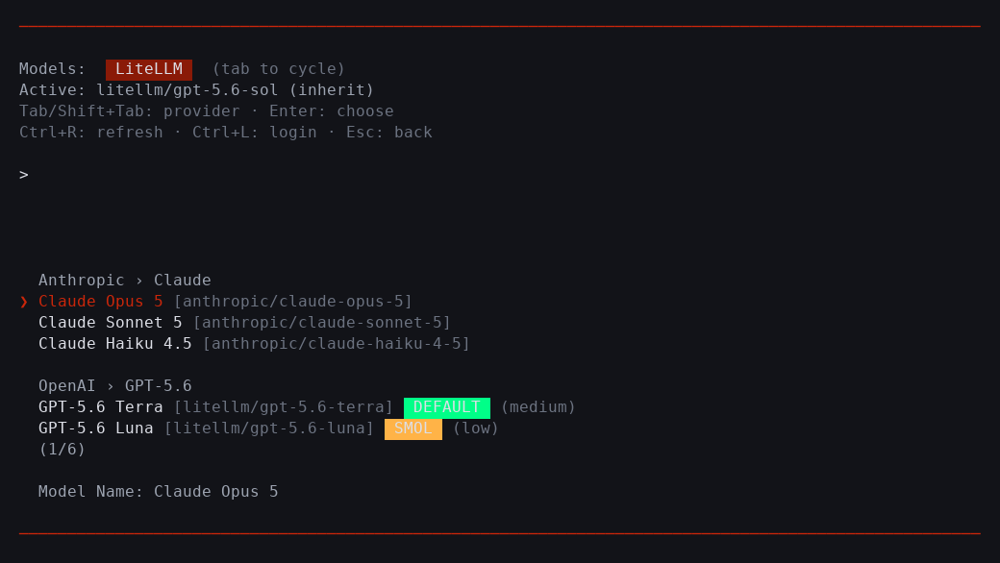
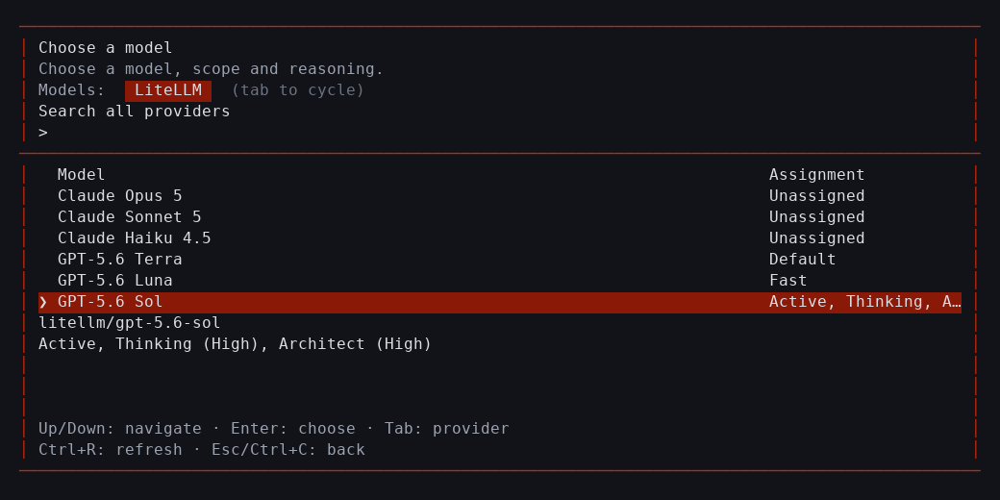

# Provider onboarding evidence

These captures use a synthetic six-model LiteLLM catalog with Anthropic Opus 5,
Sonnet 5, Haiku 4.5 and GPT-5.6 Sol, Terra and Luna. They reproduce the routes and
assignments reported by the user without contacting the internal gateway.

The before captures render the selectors from commit `f14dfba8d`. The after
captures render this change. Both use a 100-column dark Unicode theme. PNGs show
the terminal text and colors; the adjacent text files provide searchable copies.
No credentials, authorization URLs, account identities or gateway addresses are
included.

| Screen | Before | After |
| --- | --- | --- |
| Providers |  |  |
| Models |  |  |

Run the fixture capture from the repository root:

```sh
COLORTERM=truecolor bun packages/coding-agent/scripts/capture-provider-selectors.ts . /tmp/xcsh-selector-evidence
```

The script produces provider, model, scope and reasoning captures at 60×20,
80×24, 100×32 and 140×40, in dark/light themes and Unicode/ASCII symbols. The
layout tests check the terminal bounds and visible actions across all 16
combinations. Contract tests cover saved connections, failed discovery, empty
catalogs, explicit scopes, cancellation, retry, remapped bindings and restored
navigation context.

Source runtime validation on the development workstation confirmed clean startup
with a matching native addon, including the `PowerAssertion` export. An isolated
PTY verified first-run catalog entry, provider search, ChatGPT method selection
and cancellation. Live catalog checks succeeded for ChatGPT, Google Vertex AI
and vLLM; Anthropic reported that sign-in was required. Model settings were
unchanged before and after those live checks. Browser/device authorization and
recovery callbacks are exercised with synthetic fixtures, without publishing
sign-in material.

The internal LiteLLM gateway is unavailable from this workstation. The user will
complete its live walkthrough on a workstation with gateway access:

1. Open `/login`, select LiteLLM and confirm that management opens without sign-in.
2. Choose a model and verify that all six exact routes are present in one LiteLLM tab.
3. Edit the connection, then choose Done; verify active model, defaults and roles stay unchanged.
4. Browse models, cancel and return; verify the saved connection remains.
5. Apply conversation, default and role scopes separately and verify their stated effects.
6. Use an unavailable test endpoint and check retry, cached status and retained selection.
